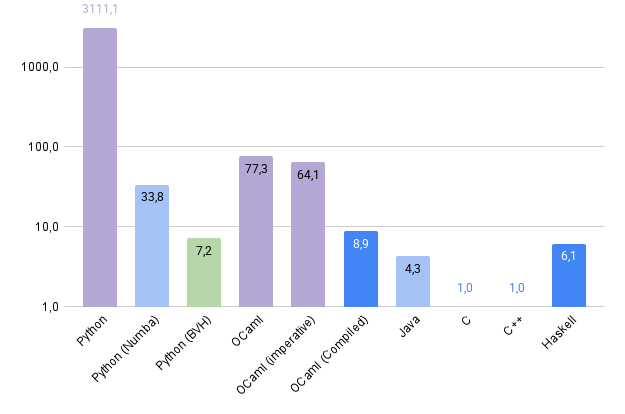

# Simple Software Rasterizer

A simple software rasterizer written in Python, OCaml, Java, C, and C++.

Side Note: All code is written manually (expect python bvh renderer).

## Times

| Language | Time (s) |
|----------|------|
| Python                   | 14min |
| Python (Numba)           |  9.13 |
| Python (BVH)             |  1.94 |
| OCaml                    | 20.86 |
| OCaml (imperative)       | 17.30 |
| OCaml (Compiled)         |  2.41 |
| Java                     |  1.15 |
| C                        |  0.27 |
| C++                      |  0.27 |
| Haskell                  |  1.66 |

Speed up vs C:
- Purple: Interpreted
- Light blue: JIT
- Blue: Compiled
- Green: BVH